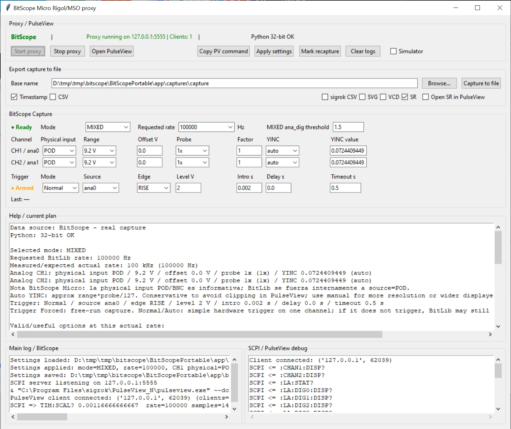

## BitScope Micro PulseView Proxy

A Python proxy that lets a **BitScope Micro** capture analog and digital signals and view them directly in **PulseView** through sigrok's existing `rigol-ds` driver.

The proxy pretends to be a Rigol MSO/DS oscilloscope over TCP SCPI. PulseView connects to it using:

```bash
pulseview --dont-scan -d rigol-ds:conn=tcp-raw/127.0.0.1/5555 -l 5
```

This project is experimental, but it is already usable for embedded debugging, logic captures, mixed analog/digital captures, and protocol decoding in PulseView.

---

## What it does

- Captures from a BitScope Micro using BitLib.
- Serves captures to PulseView as if they came from a Rigol MSO/DS scope.
- Supports analog, logic, and mixed captures.
- Supports simple hardware triggers on one BitScope channel.
- Supports pre-trigger capture using `BL_Intro()`.
- Exports captures to CSV, sigrok CSV, SVG, VCD, and `.sr`.
- Provides both a Tkinter GUI and a CLI.
- Separates the main BitScope/proxy log from the verbose PulseView SCPI/debug log.

---
<p align="center">
  
</p>

## Why?

BitScope Micro hardware is useful, but protocol decoding is much nicer in PulseView/sigrok.

This tool bridges both worlds:

- Trigger on a UART start bit and decode in PulseView.
- Trigger on SPI chip-select falling edge.
- Trigger near an I2C transaction.
- Capture mixed analog + logic signals for embedded debugging.
- Export `.sr` files for later PulseView analysis.

---

## Tested setup

Tested with:

- BitScope Micro `DB98TI79`
- BitLib `2.0 FE26B`
- Windows
- Python 3.11 32-bit
- PulseView / sigrok
- BitScope modes: `FAST`, `DUAL`, `MIXED`, `LOGIC`

Other BitScope models may work, but they are not tested.

---

## Dependencies

### Required

- Windows
- Python 3.11 32-bit
- BitScope `BitLib.dll` 32-bit
- PulseView / sigrok

### Python packages

No external Python packages are required. The project uses only the Python standard library:

- `ctypes`
- `tkinter`
- `socket`
- `threading`
- `csv`
- `json`
- `subprocess`

The GUI uses Tkinter, which must be included in your Python installation.

---

## BitLib.dll

This repository does **not** redistribute BitScope's `BitLib.dll`.

Place your own 32-bit `BitLib.dll` next to `bitscope_core.py`:

```text
src/
  bitscope_core.py
  BitLib.dll
```

The project intentionally uses a simple explicit path in `bitscope_core.py`:

```python
APP_DIR = Path(__file__).resolve().parent
BITLIB_PATH = str(APP_DIR / "BitLib.dll")
```
---

## PulseView setup

Start the proxy first, then open PulseView with:

```bash
pulseview --dont-scan -d rigol-ds:conn=tcp-raw/127.0.0.1/5555 -l 5
```

The GUI has an **Open PulseView** button that runs the same command, using the configured PulseView path.

By default, the proxy listens on:

```text
127.0.0.1:5555
```

In PulseView/libsigrok, the connection is:

```text
driver: rigol-ds
connection: tcp-raw/127.0.0.1/5555
```

Use `--dont-scan` so PulseView does not waste time scanning unrelated local drivers.

---

## What device does it emulate?

The proxy emulates enough of a Rigol MSO/DS SCPI interface for PulseView's `rigol-ds` driver to request waveform data.

It is **not** a complete Rigol oscilloscope emulator. It only implements the subset needed for PulseView captures.

The proxy responds to commands such as:

- `*IDN?`
- `:RUN`
- `:STOP`
- `:ACQ:MDEP`
- `:WAV:SOUR`
- `:WAV:XINC?`
- `:WAV:YINC?`
- `:WAV:DATA?`
- `:LA:DIGx:DISP?`

Verbose SCPI traffic can be inspected in the GUI's SCPI / PulseView debug log.

---

## BitScope modes

| Mode | Analog channels | Digital channels | Typical use |
|---|---:|---:|---|
| `FAST` | `ana0` | none | Fast single-channel analog capture |
| `DUAL` | `ana0`, `ana1` | none | Dual analog capture |
| `MIXED` | `ana0`, `ana1` | `dig0`..`dig5` | Analog + digital capture |
| `LOGIC` | none | `dig0`..`dig5` | Logic/protocol decoding |

Recommended PulseView data source:

| Mode | Recommended PulseView source |
|---|---|
| `FAST` | Segmented or Memory depending on workflow |
| `DUAL` | Memory |
| `MIXED` | Memory |
| `LOGIC` | Memory |

---

## Measured capture limits

The proxy contains measured limits for the tested BitScope Micro.

Examples:

| Mode | Requested rate | Actual rate | Real samples | Max useful time |
|---|---:|---:|---:|---:|
| `FAST` | 1 MHz | 1 MHz | 12288 | 12.288 ms |
| `DUAL` | 1 MHz | 1 MHz | 6144 | 6.144 ms |
| `MIXED` | 100 kHz | 100 kHz | 6144 | 61.44 ms |
| `LOGIC` | 1 MHz | 1 MHz | 12288 | 12.288 ms |
| `LOGIC` | 40 MHz | 40 MHz | 12288 | 0.3072 ms |

Some requested rates are clamped by BitLib/hardware. The proxy uses the measured/actual rate for PulseView timing metadata.

---

## Hardware notes

For the tested BitScope Micro, `BL_SELECT_SOURCE` appears to stay on `POD` even when `BNC` or `X10` is requested.

Because of that:

- The proxy forces BitLib source to `POD` for deterministic captures.
- The GUI field **Physical input: POD/BNC** is only a note for the user.
- Probe attenuation is handled in software using `1x`, `10x`, or a custom probe factor.

This means exported/PulseView voltages are intended to represent the physical circuit voltage, not merely the voltage seen after an attenuating probe.

---

## Probe scaling

For analog channels, the GUI supports:

- `1x`
- `10x`
- `custom`

If you use a `10x` probe, the BitScope sees one tenth of the physical voltage. The core scales analog samples by the configured probe factor so that CSV/SVG/SR/PulseView show the real physical voltage.

Trigger levels for analog channels are also treated as physical voltage. Internally, the core compensates for the probe factor before passing the level to BitLib.

Example:

```text
Probe: 10x
User trigger level: 1.6 V physical
BitLib trigger level: 0.16 V seen by BitScope
```

---

## Trigger modes

### Forced

Immediate capture. No trigger is used.

Uses:

```text
BL_Trace(0.0, False)
```

This is useful for checking that the device, mode, rate, and channel setup are working.

### Normal

Configures a hardware trigger and waits up to `timeout_s`.

Uses:

```text
BL_Trigger(level, edge)
BL_Trace(timeout_s, False)
```

Important: on the tested BitScope Micro, BitLib may still return a capture after timeout even if no trigger occurred. The proxy analyzes the returned buffer and reports a trigger status.

### Auto

Same practical BitLib behavior as Normal, but semantically accepts timeout captures as useful fallback captures.

Use this when you want:

```text
If trigger happens, synchronize on it.
If not, show me a capture anyway.
```

---

## Trigger options

### Source

Available trigger sources depend on mode:

| Mode | Trigger sources |
|---|---|
| `FAST` | `ana0` |
| `DUAL` | `ana0`, `ana1` |
| `MIXED` | `ana0`, `ana1`, `dig0`..`dig5` |
| `LOGIC` | `dig0`..`dig5` |

### Edge / condition

Supported trigger types:

- `RISE`
- `FALL`
- `HIGH`
- `LOW`

### Level

For analog channels:

```text
Level = physical voltage
```

For digital channels:

```text
Level = digital threshold voltage
Typical value: 1.5 V for 3.3 V / 5 V logic
```

### Intro

Pre-trigger time in seconds.

Example:

```text
rate = 1 MHz
intro = 0.001 s
```

The trigger event should appear roughly 1000 samples after the start of the visible capture, plus any fixed baseline offset observed in the hardware/BitLib behavior.

### Delay

Post-trigger delay in seconds.

This currently defaults to `0.0`. It exists because BitLib supports `BL_Delay()`, but most practical embedded/protocol captures should start with `0.0`.

### Timeout

Maximum time to wait for the trigger.

Typical values:

```text
0.5 s
1.0 s
```

---

## Trigger status

The proxy reports a trigger status after each capture.

Possible statuses include:

- `forced`
- `likely_triggered`
- `timeout_auto_no_event_found`
- `timeout_auto_with_event_in_buffer`
- `likely_triggered_no_event_found`
- `trace_failed`
- `unknown`

Do not rely only on `BL_Trace()` returning `True`. On the tested device, BitLib may return `True` after timeout with an automatic/free capture.

A good trigger capture usually has:

```text
elapsed_s << timeout_s
trigger_status = likely_triggered
```

A timeout fallback capture usually has:

```text
elapsed_s ~= timeout_s
trigger_status = timeout_auto_no_event_found
```

---

## Typical use cases

### UART / serial

Trigger on the falling edge of the start bit:

```text
Mode: LOGIC
Rate: 1 MHz or 2 MHz
Trigger mode: Normal
Source: dig0
Edge: FALL
Level: 1.5
Intro: 0.0005
Delay: 0.0
Timeout: 0.5
```

Then add the UART decoder in PulseView.

### SPI

Trigger on chip select:

```text
Mode: LOGIC
Rate: at least 5x-10x the SPI clock
Trigger mode: Normal
Source: dig0  # CS
Edge: FALL
Level: 1.5
Intro: 0.0001
Delay: 0.0
Timeout: 0.5
```

Then add the SPI decoder in PulseView.

### I2C

Simple trigger on SDA falling edge:

```text
Mode: LOGIC
Rate: 1 MHz or higher
Trigger mode: Normal
Source: dig0  # SDA
Edge: FALL
Level: 1.5
Intro: 0.0005
Delay: 0.0
Timeout: 0.5
```

Note: this is not a qualified I2C START trigger because it does not check that SCL is high. It is usually good enough to get close to a transaction.

### Mixed analog + logic

Trigger on a digital line and view both analog channels around the event:

```text
Mode: MIXED
Rate: 100 kHz
Trigger mode: Normal
Source: dig5
Edge: RISE
Level: 1.5
Intro: 0.002
Delay: 0.0
Timeout: 0.5
```

---

## GUI usage

Run:

```bash
python src/bitscope_rigol_proxy.py
```

Or use the provided batch file:

```bat
run_proxy.bat
```

The GUI provides:

- Proxy start/stop controls.
- PulseView launch button.
- Capture mode/rate settings.
- Per-channel analog settings.
- Trigger settings.
- Export-to-file settings.
- Main BitScope/proxy log.
- Verbose SCPI/PulseView debug log.
- Capture/trigger/client status indicators.

Recommended normal workflow:

1. Start the proxy.
2. Open PulseView from the GUI.
3. Select mode/rate/channels/trigger in the proxy.
4. Configure PulseView channels and data source.
5. Press Run in PulseView.
6. Use PulseView decoders on the captured data.

---

## CLI usage

Forced logic capture:

```bash
python src/bitscope_cli.py --mode LOGIC --rate 1000000 --out captures/logic_forced --trigger forced
```

UART-style trigger:

```bash
python src/bitscope_cli.py --mode LOGIC --rate 1000000 --out captures/uart \
  --trigger normal --trigger-source dig0 --trigger-edge FALL \
  --trigger-level 1.5 --trigger-intro 0.0005 --trigger-timeout 0.5
```

Mixed analog + digital trigger:

```bash
python src/bitscope_cli.py --mode MIXED --rate 100000 --out captures/mixed \
  --trigger normal --trigger-source dig5 --trigger-edge RISE \
  --trigger-level 1.5 --trigger-intro 0.002 --trigger-timeout 0.5
```

Analog trigger:

```bash
python src/bitscope_cli.py --mode MIXED --rate 100000 --out captures/analog_trigger \
  --trigger normal --trigger-source ana1 --trigger-edge RISE \
  --trigger-level 1.6 --trigger-intro 0.002 --trigger-timeout 0.5
```

---

## Export formats

The GUI/CLI can export:

- Full CSV
- sigrok CSV
- SVG preview
- VCD digital waveform
- `.sr` sigrok session file

`.sr` files can be opened directly in PulseView.

---

## Portable Windows package

A private portable package can be arranged like this:

```text
BitScopePortable/
  src/
    bitscope_core.py
    bitscope_rigol_proxy.py
    bitscope_cli.py
    BitLib.dll

  python32/
    python.exe
    pythonw.exe
    Lib/
    DLLs/
    tcl/

  scripts/
    run_proxy.bat
    run_proxy_debug.bat
    run_cli.bat
```

Normal GUI launcher without a persistent console:

```bat
@echo off
setlocal
set "ROOT=%~dp0.."
start "" /D "%ROOT%\src" "%ROOT%\python32\pythonw.exe" "bitscope_rigol_proxy.py"
exit /b
```

Debug launcher with console:

```bat
@echo off
setlocal
cd /d "%~dp0..\src"
"..\python32\python.exe" bitscope_rigol_proxy.py
pause
```

Do not publish a portable ZIP containing BitLib.dll unless you have redistribution rights.

For local development, you can keep the private runtime in an ignored folder such as `private-package/`.
This repository ignores `private-package/`, `python32/`, and `BitLib.dll` so they remain private.

---

## Development test signal

A useful ESP32 test signal used during development:

```text
DIG0: 5 kHz
DIG1: 2.5 kHz
DIG2: 1.25 kHz
DIG3: 625 Hz
DIG4: 312.5 Hz
DIG5: 156.25 Hz

ANA0: sawtooth, ~6.4 ms cycle
ANA1: triangle, ~12.8 ms cycle
```

Recommended validation captures:

### Digital trigger

```text
Mode: LOGIC
Rate: 1 MHz
Trigger: Normal
Source: dig5
Edge: RISE
Level: 1.5
Intro: 0.001
Timeout: 0.5
```

### Mixed trigger

```text
Mode: MIXED
Rate: 100 kHz
Trigger: Normal
Source: dig5
Edge: RISE
Level: 1.5
Intro: 0.002
Timeout: 0.5
```

### Impossible trigger / timeout behavior

```text
Mode: MIXED
Rate: 100 kHz
Trigger: Normal
Source: ana0
Edge: RISE
Level: 8.0
Intro: 0.001
Timeout: 0.5
```

Expected result:

```text
trigger_status = timeout_auto_no_event_found
```

---

## Known limitations

- Only simple one-channel hardware triggers are implemented.
- Complex triggers such as `D0 falling while D1 high` are not currently hardware-triggered.
- Qualified/software triggers may be added later.
- On the tested BitScope Micro, BitLib source selection appears fixed to `POD`.
- `BL_Trace(timeout, False)` may return data after timeout even without a real trigger.
- The proxy emulates enough Rigol SCPI for PulseView/libsigrok, not a full Rigol oscilloscope.
- Timing and size behavior is based on measured limits of one BitScope Micro.
- Windows + 32-bit Python is the main tested setup.
- `BL_Delay()` exists and is exposed, but most validation has focused on `BL_Intro()` and simple triggers.
- Asynchronous `BL_Trace(..., True)` / `BL_State()` operation is not currently used.

---

## Links

- PulseView / sigrok: https://sigrok.org/wiki/PulseView
- sigrok project: https://sigrok.org/
- BitScope: https://bitscope.com/

---

## Project status

Experimental but working.

Validated features:

- Direct PulseView connection through `rigol-ds` over TCP.
- LOGIC captures.
- MIXED captures.
- DUAL analog captures.
- FAST single analog captures.
- Simple hardware triggers.
- Pre-trigger with `BL_Intro()`.
- Timeout/auto-capture detection by buffer analysis.
- `.sr` export for PulseView.

